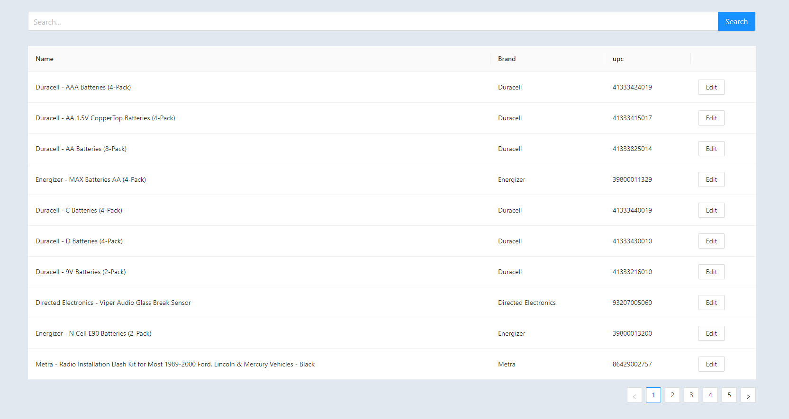
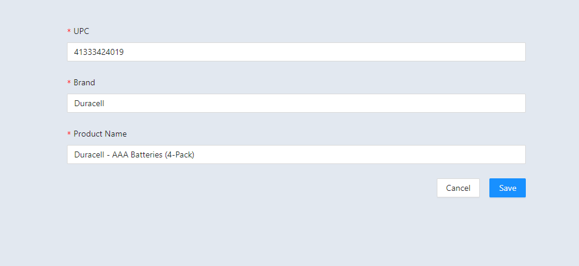

# Introduction

This project serves the purpose of assessment from Massive Infinity
[Github](https://github.com/massiveinfinity/fullstack-assessment)

# Local

To run this project, simply run `npm run start` command, and you will be able to access the frontend side from `http://localhost:3000`

# Vercel

This project can also be access on [Vercel](https://massiveinfinity-assessment.vercel.app/)

# Screenshots

On the front page, we will have the search bar on top.
Down along will the the list of items.

On Edit page, a simple form will be presented with 3 inputs for user to edit
User are able to save with the edit or cancel and back to the front page

